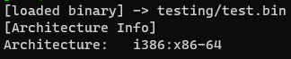
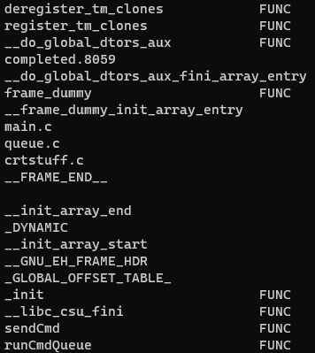

# binspector
A linux command line utility to view information about PE and ELF binaries.

## libbfd
`sudo apt install binutils-dev`

## Preview of Features

### List Sections (Displays name and size)

### Display Section Content

### List Architecture

### List symbols (Labels functions)

